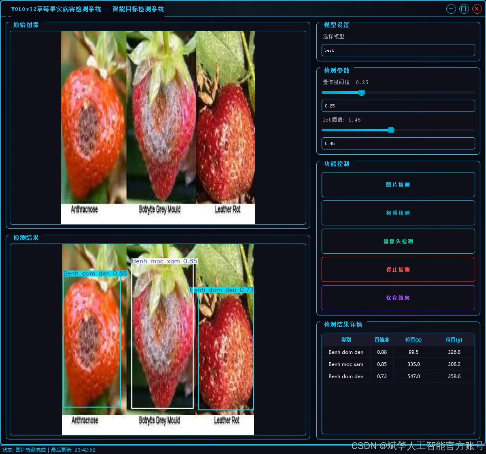
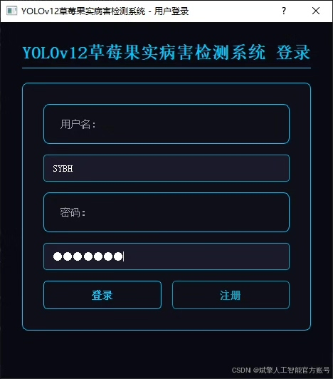
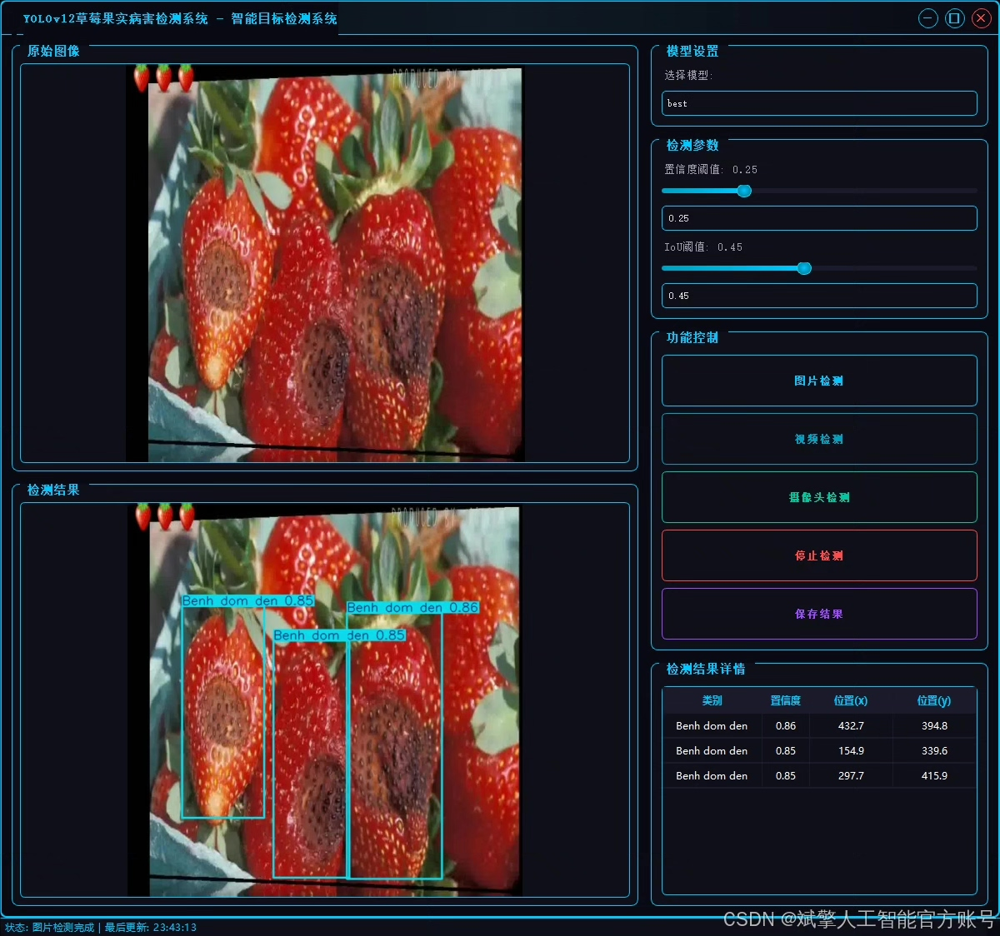
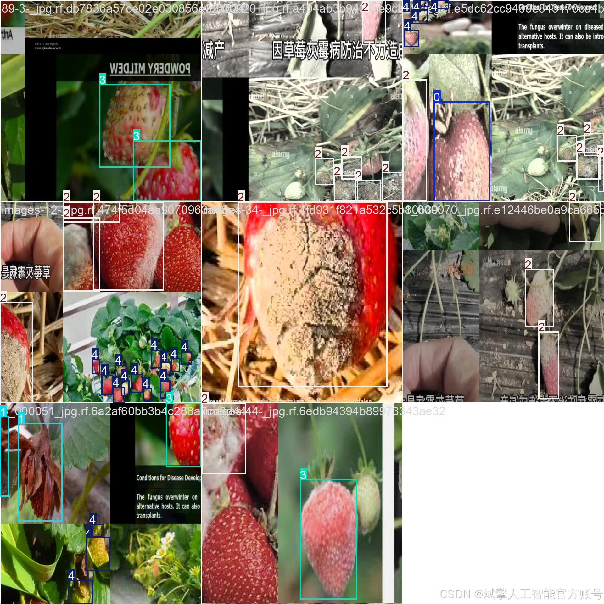
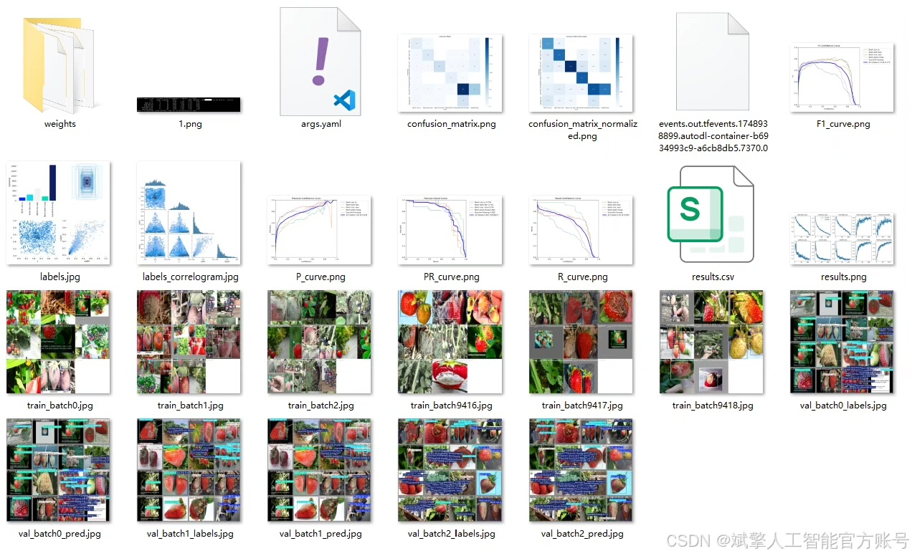
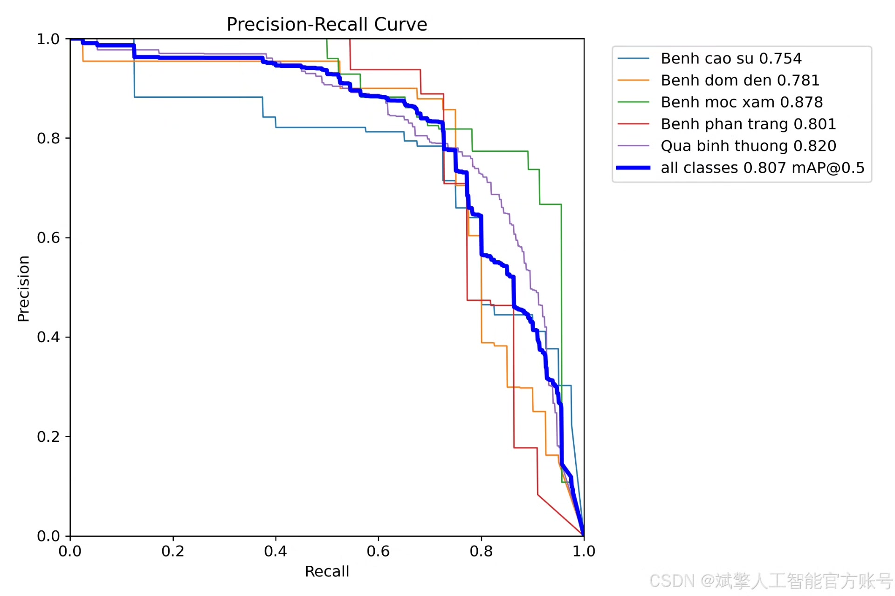
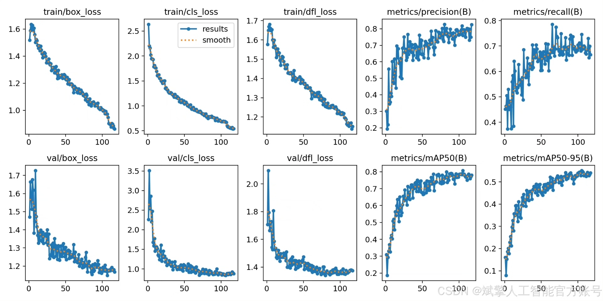
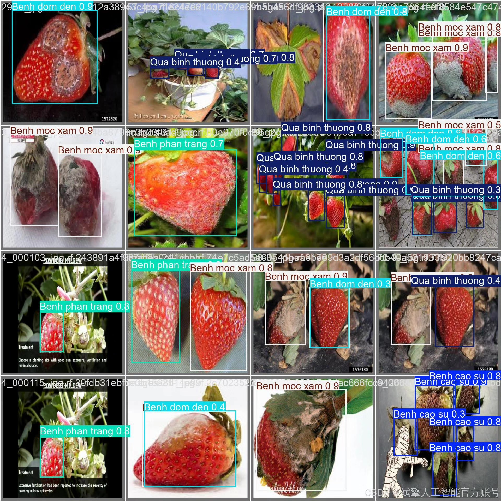

# YOLOv12 Strawberry Disease Identification System

## Body

YOLOv12 Strawberry Disease Identification System Based on Deep Learning YOLOv12

This paper develops a strawberry disease identification detection system based on the YOLOv12 deep learning framework, aiming to achieve high-precision and real-time detection of common strawberry diseases. The system recognizes five target categories, including rubber disease (Benh cao su), black spot disease (Benh dom den), gray mold disease (Benh moc xam), powdery mildew (Benh phan trang), and healthy fruits (Qua binh thuong). The dataset includes 700 training images, 81 validation images, and 103 test images. The system integrates a user-friendly UI interface, supports login and registration functions, making it convenient for farmers and agricultural technicians to use. Experimental results show that YOLOv12 has high accuracy and robustness in strawberry disease detection, providing an effective solution for intelligent management of agricultural diseases.

✅ User Login and Registration: Supports password verification and security authentication.
✅ Three Detection Modes: Based on the YOLOv12 model, supporting image, video, and real-time camera detection, with precise recognition of targets.
✅ Dual-Screen Comparison: Displays original images and detection results on the same screen.
✅ Data Visualization: Real-time table displaying the category, confidence, and coordinates of detected targets.
✅ Intelligent Parameter Tuning: Offers a confidence slide bar to dynamically optimize detection accuracy, adapting to different scene requirements.
✅ Sci-Fi Interactive Interface: Dark theme combined with dynamic light effects, reducing visual fatigue and enhancing operational experience.

## Images

## Payment

Here is a pay link on Stripe ( https://buy.stripe.com/3cs8yP7sY87d0vu9AB ). Please contact me lonlonago@foxmail.com after funding $89, and I will send you a complete data files , thank you!

